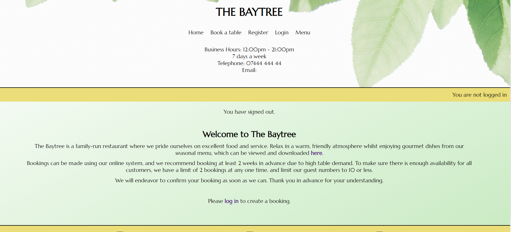
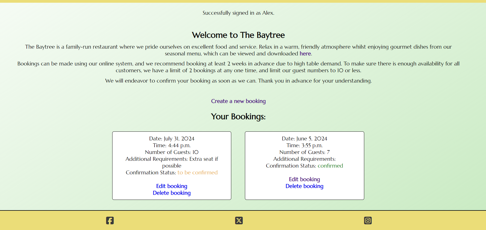
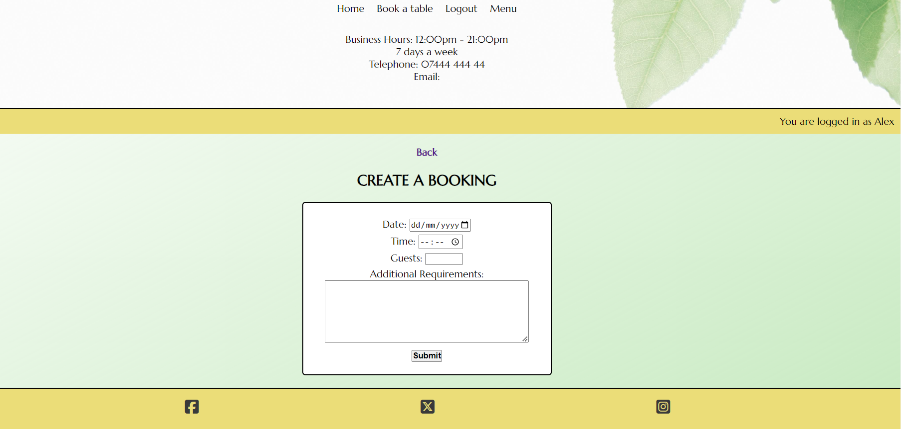
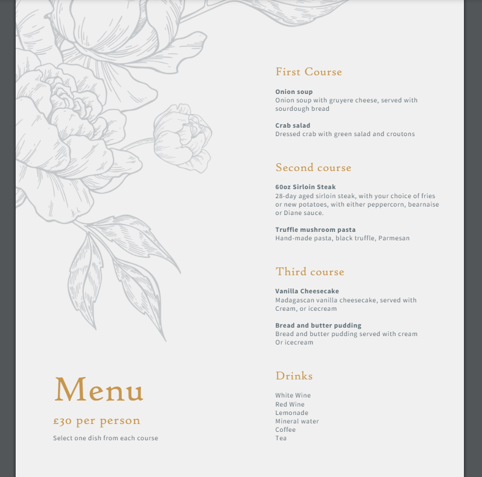
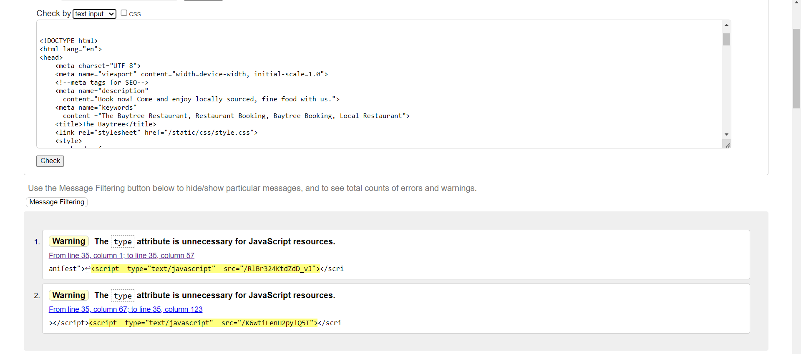
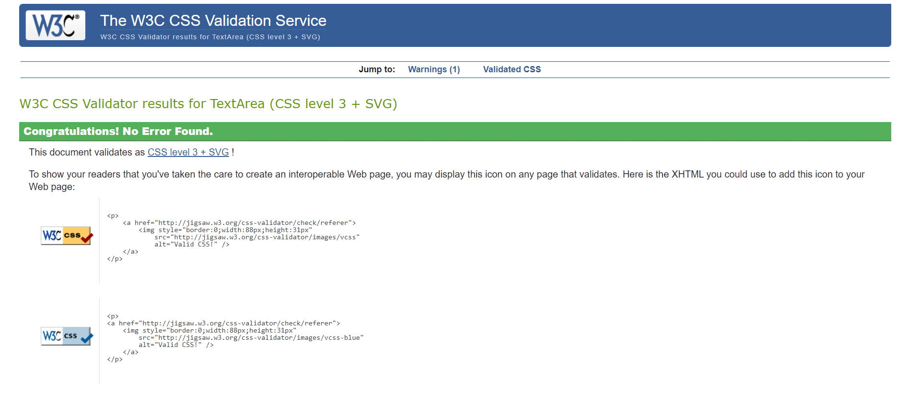
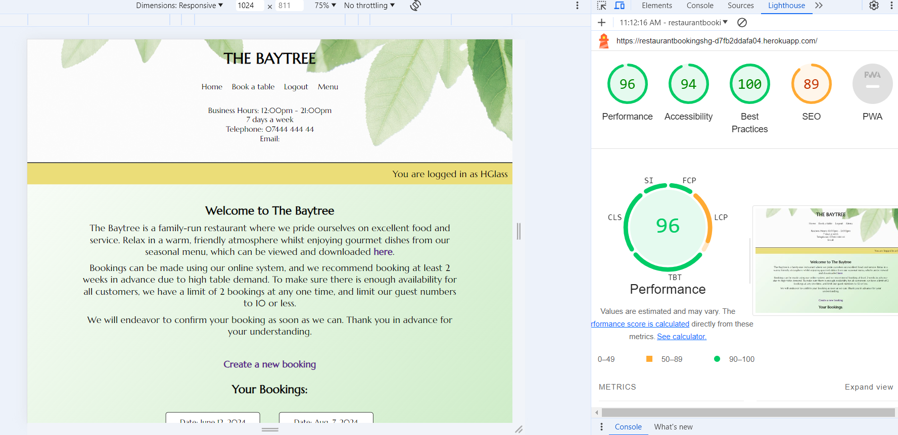

# The Baytree Restaurant - Booking System
## Contents:
1. Description
2. Design
3. Features
4. Testing
5. Deployment
6. Credits

--------------

[Site Link](https://restaurantbookingshg-d7fb2ddafa04.herokuapp.com/)

## Description:

This site is designed to allow users to be able to set up bookings at a restaurant called The Baytree. It includes several features including the ability to create an account, make bookings with custom specifications, as well as alter these bookings after they have been made. 

When visiting the site, users are given a description of the restaurant and the booking system; as well as an opportunity to view a pdf version of the menu which can also be downloaded. The contact details for the restaurant are also visible at the top of the page. 

In order to make a booking, users are required to create an account - this is so they can keep track of their individual bookings and edit them whilst logged in. 

**Site-owner Goals:**
- Provide a simple to use, easily navigable booking portal for customers - to save having to phone or email the restaurant itself.
- Allow users to see details of their bookings, as well as their confirmation status.
- Allow users to edit or delete their bookings if needed.
- Provide users with a view of the restaurant menu as part of the site

### User-stories:

**First-time user:**
- As a first time user, I want to easily see how I can make a booking, without having to click through lots of pages
- I want to be able to see the business hours of the restaurant clearly, as well as any requirements or restrictions on making bookings

**Returning user:**
- As a returning user, I want to be able to easily access my current bookings
- I want to have the option to edit or delete bookings if my plans change.

--------------

## Design: 
The design of the site was kept simple and elegant, to keep with the theme of the restaurant. Users are able to access all the site features from the homepage. The restaurant itself has an outdoor, natural theme to match it's name. This is also reflected in the menu design. The colours used are designed to give good contrast, and keep a consistent theme througout the site.

This design planning of the site was done using github projects, and was based around a set of core 'user stories', details of which can be found below:

[Github Project](https://github.com/users/HGlass07/projects/6)

**Wireframes - made using Balsamiq**
  

Wireframes

--------------
## Features:

This site has several key features that allow it to fulfil the project brief:

### User authentication:
- This allows users to see information that is relevent to them by signing in using their details. Users can come back to their saved bookings at any time.

Below is a view of the site from a signed in and not signed in perspective, showing the users current bookings

### Booking form:

- This allows users to create and customise their bookings, within certain perameters - such as the business' operating hours, and a 2 table booking limit at any one time. This information is specified clearly on the homepage.

### Menu:

- Below is the menu that users can view and download from the header and homepage text

## Future Features:

There are several features that could be implemented in this project in future:

- Automatic email confirmation - Instead of admins manually emailing users regarding their bookings, an automatic system could do this based on the confimation status of bookings.

- A 'smart' booking system, whereby user booking requests are cross-referenced with data regarding available bookings e.g. table numbers, capacity at each table.

- Bookings automatically being deleted once the booked date has elapsed - this would free up people's booking slots more efficiently.

- A seperate admin portal as part of the main site, so that admins can carry out admin functions without having to use the backend.
  
--------------
## Testing:

In the course of creating this project it was necessary to test each feature to ensure they achieved the desired outcome. Below are details of the manual testing undertaking both by myself and others - accounts were set up for several test users, as well as another admin.

Form and sign-up related buttons and features:
- User should be taken to a registration page when clicking the 'register' button in the site header - correct
- User should be taken to the login page when clicking the 'login' button in the site header - correct
- When clicking the log out button while logged in, the user should be taken to a seperate page to confirm logout - correct
- When a user confirms logout they must be returned to the homepage - correct

Views and feedback:
- When not signed in, a user should not be able to see any booking details - correct
- When signed in, the user should see their bookings, but no one elses - correct
- When a booking has been confirmed by an admin on the backend, the status of the booking should change and be visible to the user - correct
- Once a booking has been deleted it should no longer appear - correct
- When a user is logged in, the login status message should confirm this with their username - correct
- When clicking on the menu button from the header, or the homepage text, they should be presented with a pdf version of the menu - correct
- If a user attempts to create a booking without being signed in, they should be re-directed to the login page - correct

Navigation and footer buttons:
- When clicking on the home button the user should be returned to the homepage - correct
- When clicking 'back' from the login, log out and register pages, the user should be returned to the homepage - correct
- When clicking the relevent button from the register page, the user should be redirected to the login page - correct
- When clicking the relevent button from the login page, the user should be redirected to the register page - correct
- When clicking on the social media links in the footer, the user should be taken to the relevent social media site - correct 

Admin actions:
- Once an admin confirms a booking, it's status should change for the relevent user - correct
- An admin should be able to delete a booking at will if needed - correct
- An admin should be able to see user usernames and emails, but not their password - correct
- An admin should be able to add and delete users at will if needed - correct

**Bugs identified:**

**Validation:**
- W3C HTML validation 

HTML validation

- W3C CSS validator

CSS validation

- JSHint Javascript validator

JS validation

- Lighthouse - a lighthouse score was generated for the site, the results of which can be found below.

- Am I Responsive and Responsinator 

 

--------------
## Deployment:

This app was deployed with Heroku and linked to a GitHub repository, using the steps below:

- Clone or fork the relevant repository
- In your chosen IDE, type pip3 freeze --local > requirements.txt to create the requirements file.
- Create a Procfileand insert the relevent gunicorn script - web: gunicorn restaurant.wsgi
- Create a new app in Heroku
- Link the app to the relevant GitHub repository
- Ensure a secret key is created in config_vars
- Link the database URL to Heroku in config_vars
- Deploy the app, making sure the correct repository branch is selected, in this case 'main'

--------------
## Credits:

Images:
- Header image: 'Green Leaf', Min An, Pexels

Link Icons:
- Social media link icons taken from fontawesome

Favicon:
- Emoji Favicons > Herb, From the open source project Twemoji. Used under licence - https://creativecommons.org/licenses/by/4.0/

Menu Design:
- Based on the 'Elegant dinner menu' theme from Microsoft Word templates

Django Models:

The models and views used in this project were created with the aid of the following:

- Form widgets, date/time objects - Django documentation
  https://docs.djangoproject.com/en/5.0/ref/forms/widgets/
  https://docs.djangoproject.com/en/5.0/topics/i18n/timezones/

- Form strptime method - Programiz
  https://www.programiz.com/python-programming/datetime/strptime

- Reverse/reverse_lazy functions - Django documentation
  https://docs.djangoproject.com/en/5.0/ref/urlresolvers/

- Edit booking UpdateView - Geeks for Geeks
  https://www.geeksforgeeks.org/updateview-class-based-views-django/

- Booking custom model - inspired by Code Institute's 'Post' model used in the 'I Think Therefore I Blog' module

--------------
## Aknowledgements:

I would like to thank my tutor Antonio for his guidance in this project, as well as my friends and family for helping to test the app.
